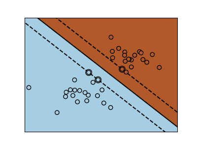
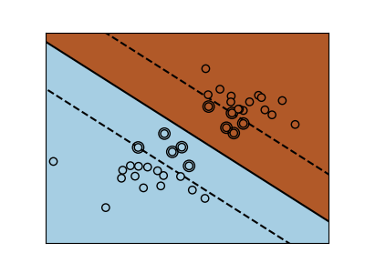

# Machine-Learning-Algorithms-Extensions
This is the final project for the CS-GY-6923 Machine Learning course at NYU Tandon School of Engineering.


## Introduction
**The goal of this project is to select three basic machine learning algorithms covered in this course, and explore how they could be improved.** We were expected to find an extension of the basic algorithm that is fully implemented by a machine learning library such as scikit-learn or Keras, and then implement this extension from scratch using only NumPy. Each extension is implemented on both the [MNIST](http://yann.lecun.com/exdb/mnist/) and [Fashion-MNIST](https://github.com/zalandoresearch/fashion-mnist) datasets.

The extensions explored in this project (with links to corresponding notebooks) are:
1. Neural network with softmax activation function in the output layer ([Keras](https://github.com/jmg764/Machine-Learning-Algorithms-Extensions/blob/master/NN%20Softmax%20with%20Keras.ipynb), [NumPy](https://github.com/jmg764/Machine-Learning-Algorithms-Extensions/blob/master/NN%20Softmax%20with%20NumPy.ipynb))
2. Neural network with dropout regularization ([Keras](https://github.com/jmg764/Machine-Learning-Algorithms-Extensions/blob/master/NN%20Dropout%20with%20Keras.ipynb), [NumPy](https://github.com/jmg764/Machine-Learning-Algorithms-Extensions/blob/master/NN%20Dropout%20with%20NumPy.ipynb))
3. Support vector machine with soft margin ([scikit-learn](https://github.com/jmg764/Machine-Learning-Algorithms-Extensions/blob/master/SVM%20Soft%20Margin%20with%20scikit-learn.ipynb), [NumPy](https://github.com/jmg764/Machine-Learning-Algorithms-Extensions/blob/master/SVM%20Soft%20Margin%20with%20NumPy.ipynb))

## Extension 1: Neural Network with Softmax

In class, we discussed setting up a neural network using sigmoid activation functions for both the hidden and output layers. However, using sigmoid as the activation function for the output layer may not be suitable for a classification problem that involves only one right answer such as classification of handwritten digits using the MNIST dataset. In the output layer, for each linear sum produced by combining the output of the previous layer with the corresponding weights and biases (z), sigmoid produces independent probabilities. Since sigmoid is applied to each raw output value separately, the resulting values are not constrained to sum to one which makes sigmoid appropriate for classification problems that involve more than one right answer. On the other hand, softmax can be used in order to obtain a probability distribution for mutually exclusive outputs such as when classifying handwritten digits. Softmax normalizes the probability of each raw output with respect to a summation of all elements thereby making each probability interrelated. In other words, when using softmax, if the probability of one class increases, then the probability of one or more other classes must decrease. Therefore, there can only be one most likely output.

### Keras Implementation

The key component for implementation of softmax is assigning the ```activation``` argument in the ```Dense``` layer to ```'softmax'```:
```python

# Define the keras model with softmax outer layer
model_plus_ext = Sequential()
model_plus_ext.add(Dense(64, activation='sigmoid'))
model_plus_ext.add(Dense(30, activation='sigmoid'))
model_plus_ext.add(Dense(10, activation='softmax'))

# Compile the keras model
model_plus_ext.compile(loss='mean_squared_error', optimizer='sgd', metrics = ['accuracy'])

# Train the keras model
model_plus_ext.fit(X_train, y_v_train, epochs = 150, batch_size = 1)

# Evaluate the keras model
accuracy = model_plus_ext.evaluate(X_test, y_v_test)
``` 

### NumPy Implementation

A softmax function was added to be used on the raw output in the final layer of the neural network. In order to avoid overflow or underflow due to the use of exponentials, np.max(z) was subtracted from z:

```python
def softmax(z):
    return np.exp(z - np.max(z))/np.sum(np.exp(z - np.max(z)), axis=0, keepdims=True) 
```

Softmax was then implemented on the raw output of the final layer as shown below:

```python
def feed_forward_with_softmax(x, W, b, nn_structure):
    a = {1: x} # create a dictionary for holding the a values for all levels
    z = { } # create a dictionary for holding the z values for all the layers
    for l in range(1, len(W) + 1): # for each layer
        node_in = a[l]
        z[l+1] = W[l].dot(node_in) + b[l]  # z^(l+1) = W^(l)*a^(l) + b^(l)
        
        # If the next layer is the output layer, use softmax
        if (z[l+1].shape[0] == nn_structure[-1]):
            a[l+1] = softmax(z[l+1])

        # Else, the next layer is a hidden layer, so use sigmoid 
        else: 
            a[l+1] = f(z[l+1]) # a^(l+1) = f(z^(l+1))

    return a, z
 ```
 
 ### Summary of Accuracies for Extension 1

 |  | **MNIST** | **Fashion-MNIST** |                 
 | :---: | :---: | :---: |   
 | **Keras Baseline** | 77.5 | 74.0 |
 | **Keras Baseline + Extension** | 88.7 | 75.4 |
 | **NumPy Baseline** | 88.5 | 11.3 |            
 | **NumPy Baseline + Extension** | 95.4 | 53.0|  
 
The NumPy extension implemented from scratch proved to be successful in improving accuracy over the NumPy baseline. However, accuracy was lower overall when using Fashion-MNIST than MNIST. This is likely because Fashion-MNIST consists of 28x28 images of clothes compared to the 8x8 images of handwritten digits in MNIST. The large increase in features makes high accuracy more challenging to achieve for a given neural network. Additionally, each class in the Fashion-MNIST dataset consists of a category of clothes which may have greater intra-class variation than in MNIST. For example, the following is a sample from the t-shirt class in Fashion-MNIST:

<p align="center">

</p>


## Extension 2: Neural Network with Dropout Regularization

Similar to other machine learning models, neural networks are susceptible to overfitting when trained on a relatively small datasets. This results in high variance which makes it unreliable for evaluating unseen data. Dropout is a method of regularization that is used to prevent this issue by approximating the simultaneous training of a large number of neural networks with different architectures. It accomplishes this by randomly ignoring a certain number of layer outputs (can be input and/or one or more hidden layers) during training which has the effect of making the layer seem like a layer with a different number of nodes than before. Temporarily removing random nodes forces other nodes within a given layer to take on more or less responsibility for inputs thereby adding noise to the training process. As a result, later layers must co-adapt in order to correct errors from the prior layers which ultimately makes the neural network more robust. When dropout is used on a given layer, weights become larger than normal. In order to combat this, it is necessary to increase the number of weights by a factor that is inversely proportional to the chosen dropout rate (for example, if a layer has 100 nodes, and a dropout rate of 0.5 is chosen, the number of nodes in that layer must be augmented to 200).

### Keras Implementation
In addition to adding dropout layers, the ```kernel_constraint``` argument is set to ```maxnorm(3)``` as recommended in the original paper on Dropout.
```python
from keras.layers import Dropout
from keras.constraints import maxnorm

# Define the keras model with softmax outer layer
model_plus_ext = Sequential()
model_plus_ext.add(Dense(64, activation='sigmoid', kernel_constraint = maxnorm(3)))
model_plus_ext.add(Dropout(0.2))
model_plus_ext.add(Dense(30, activation='sigmoid', kernel_constraint = maxnorm(3)))
model_plus_ext.add(Dropout(0.2))
model_plus_ext.add(Dense(10, activation='sigmoid'))
```

### NumPy Implementation
Parameters for configuration of the dropout rates for the input and hidden layers were added to the ```setup_and_init_weights_with_dropout``` function. Within this function, ```active_input_nodes``` and ```active_hidden nodes``` are variables containing the number of active nodes in both the input and hidden layers after setting the dropout rate, and ```active_input_indices``` and ```active_hidden_indices``` are variables containing the indices of randomly removed nodes in each layer. The subsequent loops use active_input_indices and active_hidden_indices to actually remove these weights from the original dictionary  of weights.

```python
def setup_and_init_weights_with_dropout(nn_structure, input_dropout_rate, hidden_dropout_rate):
    W = {} #creating a dictionary i.e. a set of key: value pairs
    b = {}
    for l in range(1, len(nn_structure)):
        W[l] = r.random_sample((nn_structure[l], nn_structure[l-1])) #Return “continuous uniform” random floats in the half-open interval [0.0, 1.0). 
        b[l] = r.random_sample((nn_structure[l],))
    return W, b

    active_input_nodes = int(nn_structure[0]*(1 - input_dropout_rate))
    active_input_indices = sorted(random.sample(range(0, nn_structure[0]), active_input_nodes))
    active_hidden_nodes = int(nn_structure[1]*(1 - input_dropout_rate))
    active_hidden_indices = sorted(random.sample(range(0, nn_structure[1]), active_input_nodes))
    
    # Randomly remove weights from input layer
    for i in range(len(active_input_indices)):
        W[1].remove(active_input_indices[i])
    
    # Randomly remove weights from hidden layer
    for i in range(len(active_input_indices)):
        W[2].remove(active_input_indices[i])
```

### Summary of Accuracies for Extension 2

 |  | **MNIST** | **Fashion-MNIST** |                 
 | :---: | :---: | :---: |   
 | **Keras Baseline** | 96.4 | 62.7 |
 | **Keras Baseline + Extension** | 97.7 | 77.2 |
 | **NumPy Baseline** | 86.1 | 9.9 |
 | **NumPy Baseline + Extension** | 96.0 | 11.8 |   
 
Neural networks using the Fashion-MNIST dataset likely achieved lower accuracy than those using the MNIST dataset for a similar reason as when implementing softmax: the Fashion-MNIST dataset uses higher dimensional images whose classes exhibit more intra-class variation than its MNIST counterpart. Regardless, the NumPy implementation of dropout regularization was successful since accuracies improved for both datasets over the NumPy baseline.


## Extension 3: Support Vector Machine with Soft Margin

Often times, real-world data is presented in a form that is not perfectly linearly separable. It may be possible to create boundaries between classes, but this will result in overfitting, and the model will not be useful on new data. Soft margin SVMs work around this issue by tolerating a few misclassifications on either side of the margin. This is accomplished by introducing a slack variable 𝛇 for each training example. Thus, the hyperplane to be used must satisfy y = (w^T•x + w_0) ≥ 1 - 𝛇 and 𝛇 ≥ 0. It is therefore necessary to minimize (1/2)||w||^2 + CΣ𝛇 subject to these constraints. C is a tunable parameter which decides the tradeoff between maximizing the margin and minimizing mistakes. A smaller value of C creates a softer (larger), thereby permitting more misclassifications. 

Larger C –– Harder Margin | Smaller C –– Softer Margin
:-----: | :-----:
 | 

Images from scikit-learn's [documentation](https://scikit-learn.org/stable/auto_examples/svm/plot_svm_margin.html) on SVM.


### scikit-learn Implementation

In his [lecture](https://people.eecs.berkeley.edu/~jordan/courses/281B-spring04/lectures/lec6.pdf) on soft margin SVM at UC Berkeley, [Michael I. Jordan](https://en.wikipedia.org/wiki/Michael_I._Jordan) recommends determining C through cross validation. Thus, five values of C are tested here (1e-5, 1e-3, 1e-2, 1, 1.5), and their results are validated through 20-fold cross validation:

```python

from sklearn.model_selection import KFold
from statistics import mean

kf = KFold(n_splits=20, shuffle=True)
kf.get_n_splits(X)

# Values of C to test
C = [1e-5, 1e-3, 1e-2, 1, 1.5]

avg_acc = []
# Perform cross validation for each value of C
for i in range(len(C)):
    
    acc = []
    for train, test in kf.split(X):
        clf = svm.SVC(kernel='poly', C=C[i], gamma='auto')
        clf.fit(X[train], y[train])
        y_pred = clf.predict(X_test)
        acc.append(accuracy_score(y_test, y_pred) * 100)
    avg_acc.append(mean(acc))
    acc = []
    print("C = %s" %(C[i]))
    print(avg_acc[i])
 ```

### NumPy Implementation

The library [CVXOPT](https://cvxopt.org) is used as the convex quadratic optimization solver, and the optimal value of C determined earlier (1e-2) is used:

```python 
def kernel_soft_margin_svm(X, y, C): 

    m,n = X.shape
    y = y.reshape(-1,1)
    X_y = X*y
    H = np.dot(X_y, X_y.T)
    
    P = matrix(H)
    q = matrix(-np.ones((m, 1)))
    
    # Changed G and h
    G = matrix(np.vstack((np.diag(np.ones(m))*-1, np.identity(m))))
    h = matrix(np.hstack((np.zeros(m), np.ones(m)*C)))
    
    A = matrix(y.reshape(1,-1))
    A = matrix(A, (1, m), 'd')
    b = matrix(np.zeros(1))
    
    sol = solvers.qp(P,q,G,h,A,b) 
    
    alphas = np.array(sol['x'])[:,0]
    
    return alphas

# fit svm dual classifier
alphas = kernel_soft_margin_svm(X_train, y_train, 0.01)
```

### Summary of Accuracies for Extension 3

 |  | **MNIST** | **Fashion-MNIST** |                 
 | :---: | :---: | :---: |   
 | **scikit-learn Baseline** | 98.1 | 95.3 |
 | **scikit-learn Baseline + Extension** | 99.9 | 99.7 |
 | **NumPy Baseline** | 79.8 | 87.3 |            
 | **NumPy Baseline + Extension** | 84.0 | 89.7 |  

The implementation of soft margin SVM using NumPy and CVXOPT successfully resulted in accuracy improvements for both MNIST and Fashion-MNIST.


